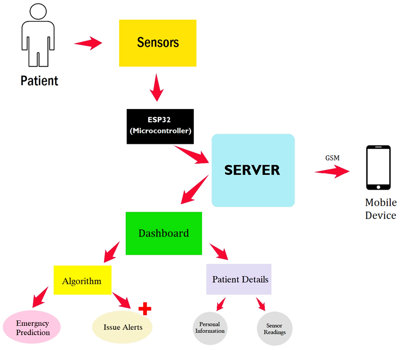
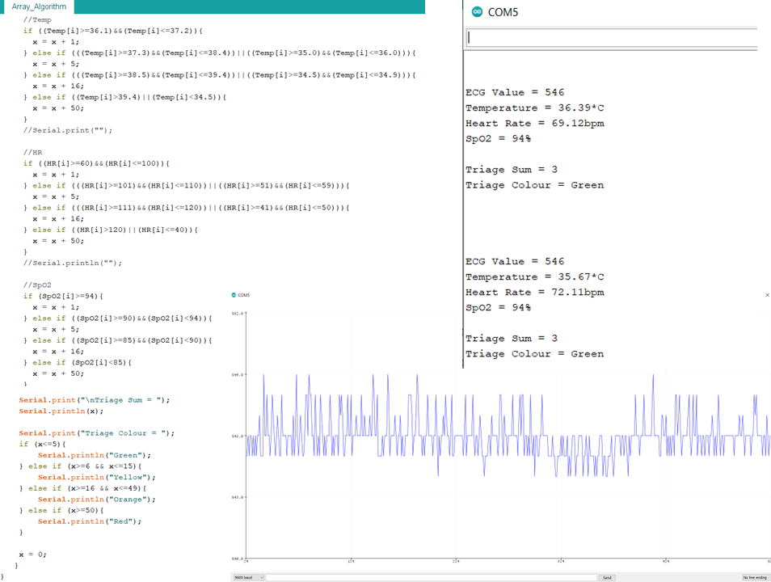
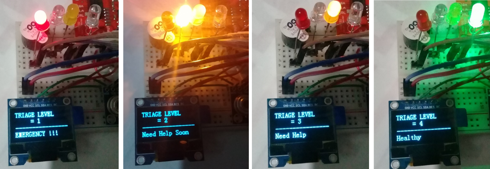
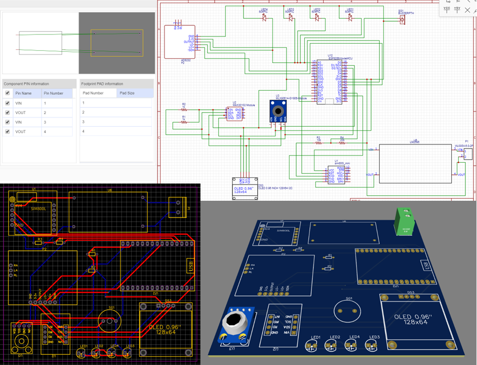
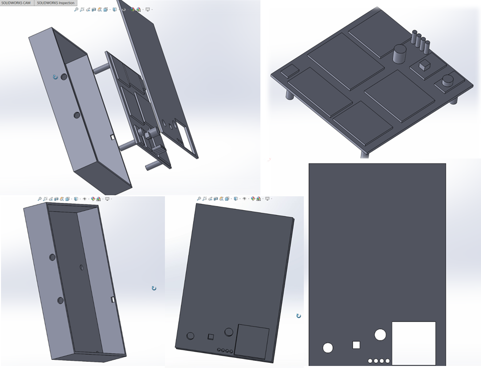
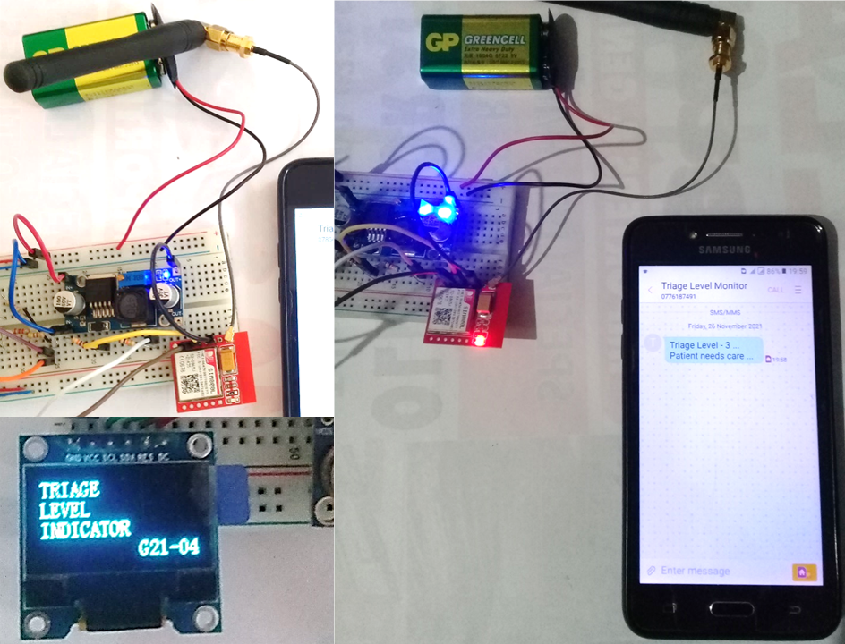

# 🏥 Real Time Triage Monitoring System

IoT-Based Patient Monitoring System with Triage Level Indication
> This is a final year **group project** developed as part of our academic curriculum, completed in 2021.

> The following documentation highlights **my individual contribution** to the hardware development, sensor integration, triage algorithm implementation, and prototype design.

---

## 📌 Project Overview  

The project monitors a patient’s health parameters using various sensors and sends the data securely to an IoT dashboard. Real-time alerts and triage levels are indicated on a hardware module and also sent via SMS using GSM.

  

---

## 🎯 Objectives  
- Real-time monitoring of **vital signs** (ECG, SpO₂, HR, Temp).  
- Automated **triage level calculation** using scoring algorithm.  
- Emergency alerts via **LED, buzzer, and GSM SMS**.  
- Prototype with PCB + 3D printed enclosure.  

---

## ⚙️ My Individual Contribution

- Hardware setup and circuit design
- Sensor integration and data collection
- Implementation of a custom triage algorithm
- PCB and prototype model design
- GSM-based alert message system
  
---

## 🛠️ Development Timeline

1. Selected and purchased sensor components
2. Configured circuits and programmed microcontroller
3. Read sensor outputs and validated accuracy
4. Developed triage algorithm and integrated it into system
5. Designed PCB using EasyEDA
6. Designed 3D prototype model using SolidWorks
7. Integrated GSM module to send alerts to mobile

---

## Hardware Design  

### ⚙️ Hardware Setup  
- **Microcontroller**: Arduino/ESP-based controller for data acquisition.  
- **Sensors**: Vital signs (e.g., temperature, pulse, SpO₂) and environmental sensors (humidity, temperature).  
- **Communication**: ESP8266 WiFi module for IoT connectivity.  
- **Data Processing**: Patient health status processed in real-time.  
- **Visualization**: Data displayed via a web dashboard / local monitoring station.  

### 🧩 Components Used

| Component | Description |
|----------|-------------|
| NodeMCU ESP8266 | Microcontroller + Wi-Fi |
| AD8232 | ECG Heart Monitoring Sensor |
| MAX30100 | Pulse Oximeter & Heart Rate Sensor |
| MLX90614 | Contactless Temperature Sensor |
| SIM800L | GSM Module |
| LCD Display | OLED for output display |

> Note: NIBP sensor was planned to be used for measuring blood pressure, but couldn't be procured due to the pandemic.

### Pin Configurations  
- ECG (AD8232) → A0, D5, D6  
- Pulse Oximeter (MAX30100) → I2C (D1, D2)  
- Temperature Sensor (MLX90614) → I2C (D1, D2)  
- LCD Display → I2C (D1, D2) + DC/RES (D5, D6)  
- GSM Module (SIM800L) → D3 (RX), D4 (TX), external 3.7V–4.4V supply  
> A 9V battery + LM2596 buck converter was used to power the GSM module (3.4V – 4.4V).

---

## 🧮 Triage Algorithm  

The algorithm assigns **points** to vital signs and generates a triage level.  

### 📊 Vital Sign Classification

| Vital Sign | Level A | Level B | Level C | Level D |
|------------|---------|---------|---------|---------|
| Heart Rate (bpm) | 60–100 | 51–59 / 101–110 | 41–50 / 111–120 | ≤40 / ≥120 |
| SpO₂ (%) | 94–100 | 90–93 | 85–89 | <85 |
| Temp (°C) | 36.1–37.2 | 35–36 / 37.3–38.4 | 34.5–34.9 / 38.5–39.4 | <34.5 / >39.4 |

### 🧮 Scoring System

| Level | Points |
|-------|--------|
| A     | 1      |
| B     | 5      |
| C     | 16     |
| D     | 50     |

### Triage Decision Table  

| Score | Triage Level | Colour | Status |
|-------|-------------|--------|--------|
| 1–5   | 4 | 🟢 Green | Safe |
| 6–15  | 3 | 🟡 Yellow | Need Help |
| 16–49 | 2 | 🟠 Orange | Immediate Help |
| ≥50   | 1 | 🔴 Red | Emergency |  

### Arduino Code Snippet & Serial Monitor Outputs
  

### LED Outputs

#### 🔴🟠🟡🟢 Triage Level Indication
- 4 LED indicators (Green, Yellow, Orange, Red)
- Buzzer alert for critical level
- OLED display shows the triage level
  
  

---

## 🧾 PCB Design

Designed using EasyEDA. Custom footprints were created for unavailable components.

- Copper Thickness: 2mm
- Track Width: 0.6mm
- Clearance: 0.3mm

  

---

## 📦 Prototype Model

Modeled in **SOLIDWORKS 2020** with three main parts:

1. Enclosure Box
2. PCB
3. Top Lid

---

## 📲 GSM Alert System

Used **SIM800L** to send SMS alerts to mobile devices when triage level is critical.

---

## ✅ Sensor Accuracy Validation

| Sensor     | Validation Device       | Result |
|------------|-------------------------|--------|
| MAX30100   | Pulse Oximeter          | ✅ Matched |
| MLX90614   | Digital Thermometer     | ✅ Matched |
| AD8232     | ECG Visual Graph Output | ✅ Verified |

---

## ⚠️ Issues Faced  

- **MAX30100 Pulse Oximeter Sensor**: The sensor had issues with built-in resistors and didn’t work well with ESP-12E. I added extra resistors to fix it, but it still had issues with other sensors.
- **ECG Pad Placement**: Correct placement of AD8232 ECG pads on the body was tricky. After research, I placed them near the chest for more reliable readings.
 > A. Newton, “IoT Based ECG Monitoring with AD8232 ECG Sensor & ESP32.” how2electronics.com, May 17, 2020. [Online]. Available: [Here](https://how2electronics.com/iot-ecg-monitoring-ad8232-sensor-esp32/). (Accessed May. 10, 2021)
- **GSM Module Antenna**: The default helical antenna didn’t work well indoors, so I replaced it with a 3dBi GSM antenna for better reception.  
- **Prototype Bulkiness**: The device was large because sensors and modules were mounted separately.
- **COVID-19 Pandemic**: Purchasing parts, doing proper testing, and real-world validation were limited.

---

## 🚀 Future Improvements  

- Custom PCB integrating sensor front-ends directly into the MCU to reduce size.  
- Low-power optimization for longer operation on battery.
- Fully 3D print and assemble the enclosure for field deployment.
- Expand dashboard integration with real-time triage history.

---

## 🛠 Tools & Software Used
- Arduino IDE – Programming the NodeMCU ESP8266 microcontroller
- EasyEDA – Designing the PCB circuit and layout
- SolidWorks 2020 – 3D modeling the prototype enclosure

---

## 📄 License
This repository documents the individual hardware-focused contribution to a group-based IoT healthcare project.
Other group members were responsible for the server-side dashboard, database integration, and UI development.
This project is solely shared for educational purposes. Please give credit if you use it.

---

## 📬 Contact
If you have feedback or suggestions, feel free to [open an issue](https://github.com).

---
